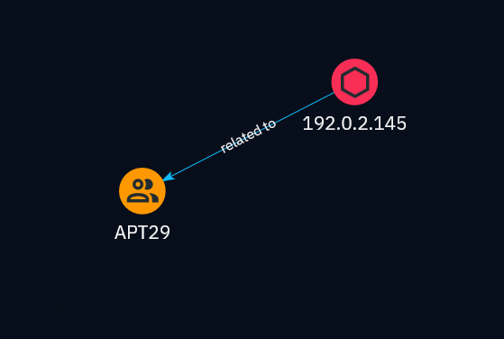

# Cyber-Threat-Inetelligence-CTI-Investigation-Lab-APT29-Infrastructure-Modelling



## Overview

This repository documents an end-to-end Cyber Threat Intelligence (CTI) investigation into state-sponsored threat actor APT29 (Midnight Blizzard / Cozy Bear). Using an enterprise OpenCTI deployment, unstructured indicators were structured into STIX 2.1 domain objects, mapped against the MITRE ATT&CK matrix, and visualized to enable actionable detection engineering.

## Objectives

* Deploy a production-grade CTI platform stack using Docker Compose and OpenCTI.
* Structure raw observables (192.0.2.145, login-update-auth.com) into STIX 2.1 hypergraphs.
* Formulate data sharing controls based on Traffic Light Protocol (TLP) standards.
* Author threat detections (Sigma) targeting adversary initial access and persistence TTPs.


## Technical Architecture & Setup

The CTI platform environment operates as a containerized stack hosted on Linux:
* **Platform:** OpenCTI v6.x Platform Stack
* **Container Environment:** Docker Engine via Linux System Daemon
* **Core Microservices:** Elasticsearch / OpenSearch, PostgreSQL, Redis, RabbitMQ, MinIO

```
# Environment Verification & Startup
cd ~/cti_lab/opencti
docker compose up -d
```

## Threat Intelligence Briefing (TLP:AMBER)

**Report ID:** CTI-INT-2026-0801

**Threat Actor:** APT29 (Midnight Blizzard / Cozy Bear)

**Targeted Sectors:** Cloud Infrastructure, IT Managed Service Providers, Defense

### 1. Passive DNS & Infrastructure Correlation

Analyst investigation mapped an initial spearphishing domain back to primary command-and-control (C2) hosts using pDNS history:

```
[Phishing Domain] login-update-auth[.]com
                        |
            (A Record / pDNS Resolution)
                        |
                 192.0.2.145 (C2 IP)
```

### 2. MITRE ATT&CK Mapping

* **Initial Access:** T1566.002 (Spearphishing Link)
* **Credential Access:** T1528 (Steal Application Access Token)
* **Command & Control:** T1071.001 (Application Layer Protocol: Web Protocols)

### 3. TLP Data Handling Controls

* **TLP:CLEAR:** Public TTP classifications, generic ATT&CK IDs, YARA signatures.
* **TLP:AMBER:** Specific internal host IP targets, active C2 pDNS correlation data, internal analyst investigation logs.

## Detection Artifacts

### Sigma Rule: Suspicious Cloud Token Extraction

```
title: APT29 Suspicious OAuth Token Request Pattern
id: 9d12a4b0-3c2f-485a-821b-123456789abc
status: experimental
description: Detects process executions attempting to acquire cloud tokens via PowerShell.
logsource:
  category: process_creation
  product: windows
detection:
  selection:
    Image|endswith: '\powershell.exe'
    CommandLine|contains:
      - 'Get-AzAccessToken'
      - 'login-update-auth'
  condition: selection
level: high
tags:
  - attack.initial_access
  - attack.t1528
```
## Mitigation & Defensive Recommendations

1. **Network:** Ingest 192.0.2.145 and login-update-auth[.]com into perimeter DNS sinkholes and firewall blocklists.
2. **Identity:** Audit active OAuth applications; force credential resets and revoke access tokens for compromised user sessions.
3. **Detection:** Deploy the provided Sigma rule across EDR and SIEM platforms to monitor for unauthorized credential harvesting commands.
